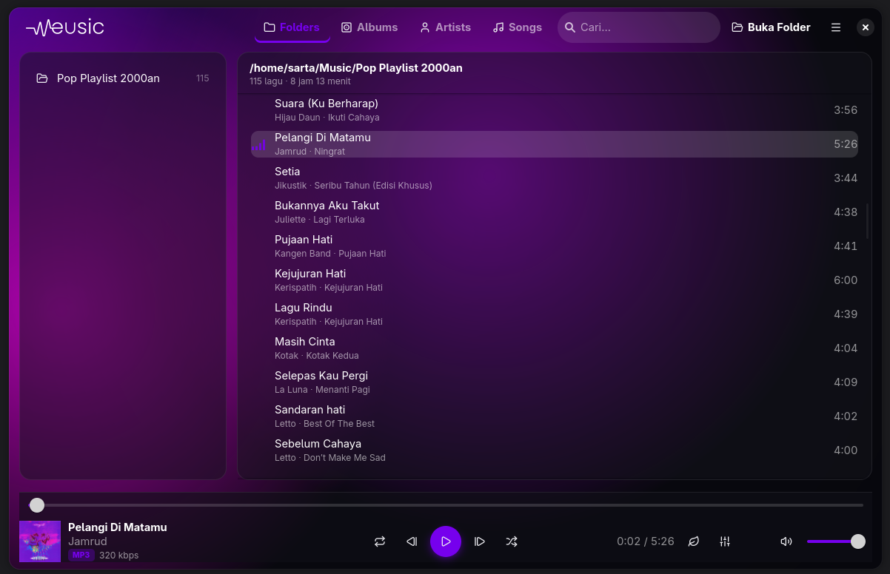
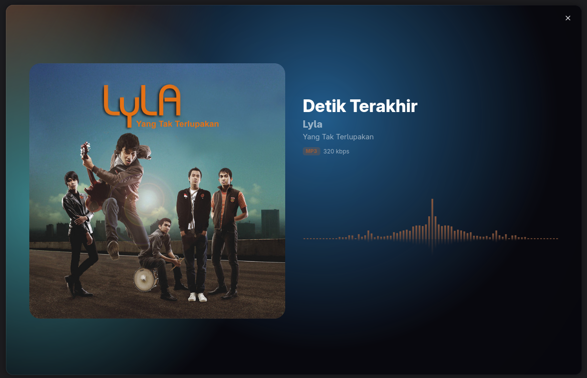
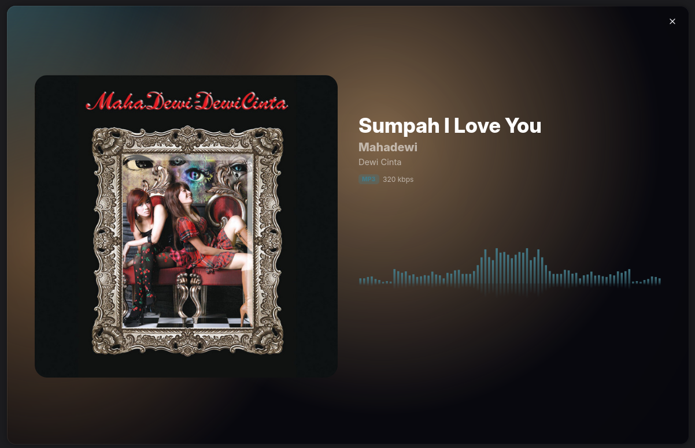
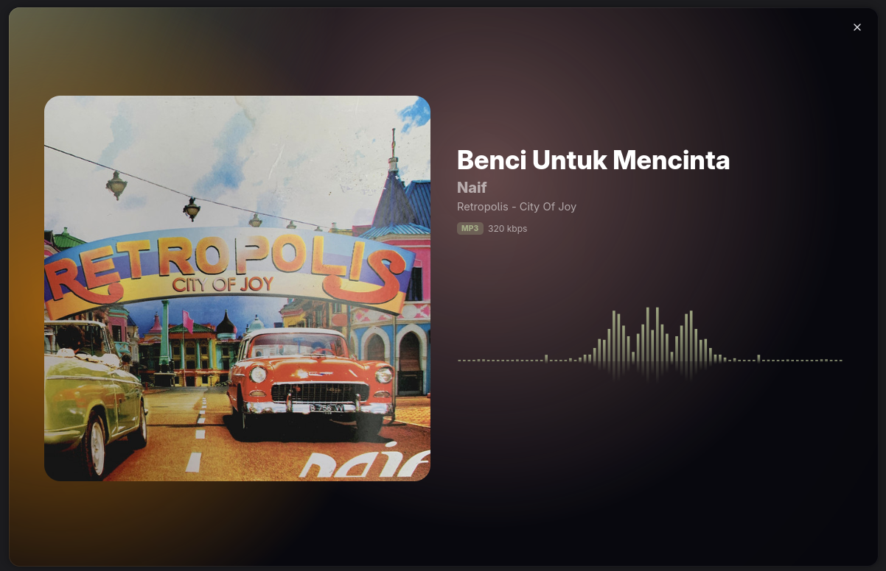

<p align="center">
  
</p>

<p align="center">
  A lightweight, native music &amp; internet-radio player for Linux<br>
  built with GTK4, libadwaita, relm4, and Rust.
</p>

<p align="center">
  
  
  
  
  
  
  
</p>

---

## Overview

**meusic** is a fast, low-footprint native desktop player for your local music library. Point it
at a folder and it recursively scans every track inside — including all subfolders — reading tags
and cover art, then lets you browse by folder, album, artist, or song.

The visual identity is **inspired by [Amberol](https://gitlab.gnome.org/World/amberol)**: an
adaptive background whose colors flow from the album art of whatever is playing, with a live
spectrum visualizer. The browsing layout is **inspired by [Dopamine](https://github.com/digimezzo/dopamine-windows)**:
a clean top-bar mode switcher (Folders / Albums / Artists / Songs) with a folder list on the left
and a track list on the right.

It also doubles as an **internet-radio player**: a built-in Music / Radio switch turns the same
window into a station browser with a live now-playing pane (station name, current song via ICY
metadata, stream quality) and the same adaptive gradient + visualizer. Stations are fully
editable (add / edit / delete) and stream directly through GStreamer, so the equalizer and
visualizer work on radio too and reconnect is resilient to network drops.

Built as a **native GTK4 / libadwaita** application — no web view, no Electron — it stays light:
playback runs on GStreamer, idle animations pause to keep the CPU and GPU quiet, and it integrates
with the desktop via **MPRIS** so the media flyout, media keys, and now-playing widgets pick it up
(album art and all). It resumes your last session on launch and offers a power-save mode for the
lightest possible footprint.

> **Platform note:** meusic is Linux-only. It is developed and tested on Fedora (GNOME / Wayland)
> and targets any modern GTK4 + GStreamer desktop. It is a ground-up native rewrite of an earlier
> Tauri/WebView build (the older sources still live under `src-tauri/` and `src/` for reference).

## Screenshots

The background palette is extracted from each track's cover art and transitions smoothly as the
music changes.

<table>
  <tr>
    <td></td>
    <td></td>
    <td></td>
  </tr>
  <tr>
    <td></td>
    <td></td>
    <td></td>
  </tr>
</table>

## Features

- **Recursive folder scanning** — finds every track in a folder and all its subfolders (parallel
  scan via `rayon`).
- **Wide format support** — MP3, FLAC, M4A / AAC, OGG, Opus, WAV, AIFF, WMA.
- **Adaptive gradient UI** — the background and accent colors are derived from the current
  cover art and cross-fade on track change, drawn natively with GTK snapshots / Cairo.
- **Four browsing modes** — Folders, Albums, Artists, and Songs, with the playing item marked.
- **Virtualized song list** — a `GtkListView` keeps scrolling smooth on large libraries.
- **Cover art** — read from embedded tags, with a fallback to folder images
  (`cover.jpg`, `folder.jpg`, and similar); downscaled and cached to stay light.
- **Now-playing details** — title, artist, album, audio format, and bitrate; folder headers
  show total runtime and artist/album counts.
- **Full transport** — play / pause, next / previous, seek, volume, shuffle, and repeat
  (off / all / one); mouse-wheel over the volume control adjusts it, with a percentage readout.
- **6-band equalizer** and a spectrum visualizer, powered by GStreamer.
- **Now Playing view** — full-screen cover + visualizer over the adaptive gradient.
- **MPRIS media controls** — now-playing (title / artist / album / cover and position) is
  published to the desktop over D-Bus, so the media flyout, keyboard media keys, and now-playing
  widgets read it and control playback.
- **Resume** — remembers the last folder, page, track, and playback position across restarts.
- **Follow song** — the list auto-scrolls to the track that's playing.
- **Power-save mode** — flat background, paused animations, and the spectrum analysis switched
  off for the lightest footprint.
- **Global search** across title, artist, and album.
- **Responsive chrome** — the top and bottom bars collapse to icons on narrow windows
  (libadwaita breakpoints).
- **Close to minimize** — on a trayless desktop, closing the window keeps playback running in the
  background (restore from the dock / overview); a Quit item exits fully.
- **Settings** — toggles for resume, follow-song, volume step, power-save, and window behavior.

### Radio

- **Internet-radio mode** — a Music / Radio switch turns the window into a station browser: a
  station list on the left and a now-playing pane on the right with a circular spectrum visualizer
  and adaptive gradient (tinted from the station's color).
- **Live stream info** — current song via ICY metadata, plus stream codec and bitrate.
- **Editable stations** — add, edit, and delete stations; saved to disk and seeded from a bundled
  Indonesian-radio list on first run.
- **Direct GStreamer streaming** — stations play straight through the audio pipeline, so the
  equalizer and visualizer work on radio and plain-`http://` stations play fine.
- **Resilient connection** — exponential-backoff reconnect, a stall watchdog, and automatic
  recovery when the network returns; permanent failures (bad URL / auth) are surfaced clearly.

## Tech Stack

| Layer    | Technology                              | Responsibility                                            |
| -------- | --------------------------------------- | --------------------------------------------------------- |
| UI       | GTK4 + libadwaita via `relm4`           | Reactive components, adaptive styling, responsive layout  |
| Audio    | GStreamer (`playbin3`, `equalizer-10bands`, `spectrum`) | Playback, 6-band equalizer, spectrum for the visualizer |
| Library  | Rust (`lofty`, `walkdir`, `rayon`)      | Recursive scan, tag and cover-art extraction (parallel)   |
| Color    | Rust + `gdk-pixbuf`                     | Dominant-palette extraction from cover art for the adaptive gradient |
| Desktop  | `zbus` (MPRIS2)                         | Now-playing metadata, cover art, and media-key control over D-Bus |

## Getting Started

### Prerequisites

- [Rust](https://www.rust-lang.org/tools/install) (stable, edition 2024)
- GTK4 and libadwaita development libraries
- GStreamer 1.x with the **base** and **good** plugin sets

On Fedora:

```bash
sudo dnf install gtk4-devel libadwaita-devel \
  gstreamer1-devel gstreamer1-plugins-base gstreamer1-plugins-good
```

On Debian / Ubuntu:

```bash
sudo apt install libgtk-4-dev libadwaita-1-dev \
  libgstreamer1.0-dev gstreamer1.0-plugins-base gstreamer1.0-plugins-good
```

### Development

```bash
cd meusic-gtk
cargo run
```

### Build

```bash
cd meusic-gtk
cargo build --release
```

The optimized binary is produced at `meusic-gtk/target/release/meusic`.

### Packaging

Prebuilt **RPM** and **DEB** packages are attached to the
[Releases](https://github.com/s4rt4/meusic-linux/releases). To build them yourself:

```bash
cd meusic-gtk
cargo build --release
cargo generate-rpm          # -> target/generate-rpm/*.rpm
cargo deb                   # -> target/debian/*.deb
./packaging/build-appimage.sh   # -> target/appimage/*.AppImage
```

## Project Structure

```
meusic-gtk/
  src/main.rs            App orchestration: window, top/bottom bars, modes, session, overlay
  src/library.rs         Recursive scan, Track struct, tag + cover-art reading (lofty)
  src/player.rs          GStreamer playbin3 wrapper: playback, equalizer, spectrum, EOS/bus
  src/art.rs             Cover-art textures, palette extraction, station chip rendering
  src/mpris.rs           Native MPRIS2 service over D-Bus (zbus): metadata, art, controls
  src/stations.rs        Radio station model, persistence, bundled seed list
  src/settings.rs        Persisted user settings (resume, follow, power-save, volume, ...)
  src/session.rs         Last-session state (folder, mode, track, position) restore
  src/track_object.rs    GObject wrapper for the virtualized GtkListView model
  src/util.rs            Config-path helpers
  assets/                Logo, icon, bundled radio-station seed list
  icons/                 Bundled Lucide-derived SVG icon set (compiled into a GResource)
  resources/             GResource manifest (icons + logos)
  packaging/             .desktop entry + AppImage build script
src-tauri/, src/         Legacy Tauri/WebView build, kept for reference (not built)
```

## Acknowledgments

- **UI inspired by [Amberol](https://gitlab.gnome.org/World/amberol)** — the adaptive,
  cover-art-reactive background and visualizer.
- **Layout inspired by [Dopamine](https://github.com/digimezzo/dopamine-windows)** — the
  Folders / Albums / Artists / Songs browsing model.
- Built with **GTK4**, **libadwaita**, **[relm4](https://relm4.org/)**, **GStreamer**, and **Rust**.

These projects are independent works under their own licenses; meusic shares none of their code
and only draws on them as design inspiration.

## License

Released under the [MIT License](LICENSE).
